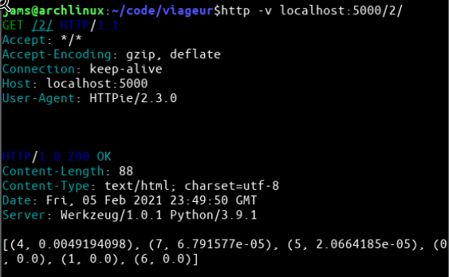

## Start Server
    docker-compose up -d
    
## Use cases
    # Add user data (userid=2) (tripid=4)
    http POST localhost:5000/2/submit/ trip=4
    
    # View user recommendations (userid=2)
    http localhost:5000/2/
 

